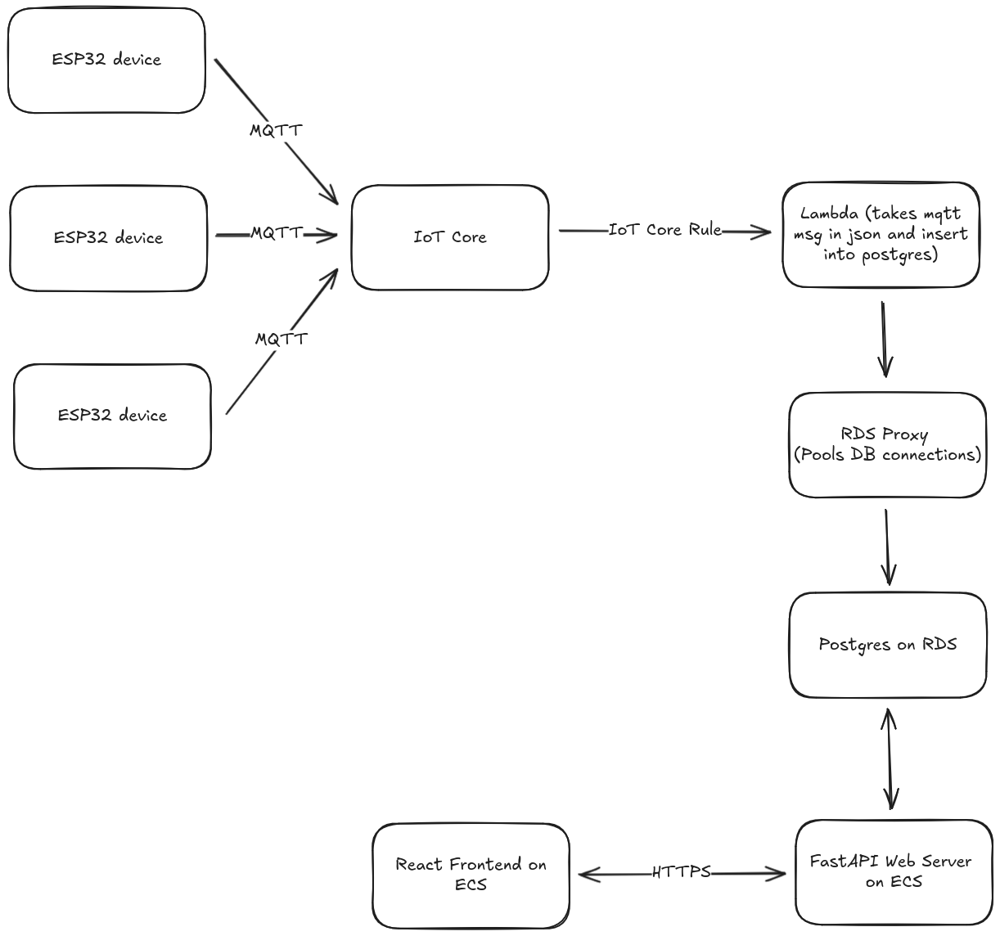

# 50.046 Cloud Computing and IoT - Final Project

## Project Description

Our goal is to create an analytics system for restrooms in places with high traffic (e.g. Shopping malls and institutions).

The main features of our project:

- Display of restroom unit occupancy to surrounding people, increasing convenience and improving the experience of urgent restroom users.
- Analysis of restroom usage to encourage efficient cleaning and maintenance deployments.

To execute this we have come up with the following solution.

## System Diagram



## Running the Project

### Production Deployment

Ensure you have `aws-cli` and `terraform` installed locally on your machine.

To deploy, we first have to create the RDS credentials in AWS SecretsManager. Note that these secrets will be used for the production deployment so please change the username and password to secure ones. Use `aws-cli` to create the secret by running:

```bash
aws secretsmanager create-secret \
  --name rds_credentials \
  --secret-string '{"username":"iot_master","password":"S3cureRandomPassw0rd!"}'
```

After creating the secrets, use terraform to apply the infrastructure under your AWS account.

```bash
terraform apply
```

### Running Locally

The goal of local development is to approximate the cloud components (Lambda, RDS/Postgres, IoT Core MQTT, Secrets Manager) with lightweight containers so frontend and backend teams can iterate rapidly.

#### Overview of Local Substitutions

| Cloud Component                   | Local Equivalent                                                             |
| --------------------------------- | ---------------------------------------------------------------------------- |
| AWS Lambda (Node 20)              | Node HTTP wrapper calling the same handler (`lambda/local-server.ts`)        |
| RDS (Postgres)                    | `postgres` container                                                         |
| Secrets Manager (rds_credentials) | `.env` file (`DB_USER`, `DB_PASSWORD`, etc.)                                 |
| IoT Core MQTT topics              | Eclipse Mosquitto broker (`mqtt` service)                                    |
| IoT Rule -> Lambda                | Bridge sidecar (`bridge-mqtt-to-lambda`) invoking local lambda HTTP endpoint |

#### 1. Copy Environment File

Create your local `.env` from the example:

```bash
cp .env.example .env
```

Edit values as needed (e.g. stronger passwords). Docker Compose will read them automatically.

#### 2. Start the Stack

```bash
docker compose up -d --build
```

Services started:

- Postgres (port 5432)
- Mosquitto MQTT broker (port 1883)
- Local Lambda emulator (HTTP invoke on `http://localhost:8080/invoke`)
- LocalStack (optional AWS API emulation on port 4566; limited IoT support)
- Bridge container subscribing to `sensors/#` MQTT topics and invoking the lambda
- Placeholder `backend` and `frontend` containers (replace commands once you add code)

#### 3. Create Table Schema

The lambda expects a table `sensor_data` with a `payload` column:

```bash
docker compose exec postgres psql -U "$DB_USER" -d "$DB_NAME" -c 'CREATE TABLE IF NOT EXISTS sensor_data (id SERIAL PRIMARY KEY, payload JSONB, created_at TIMESTAMPTZ DEFAULT NOW());'
```

#### 4. Simulate an IoT Message

Publish a test MQTT message:

```bash
mosquitto_pub -h localhost -p 1883 -t sensors/device123 -m '{"temperature":23.5,"humidity":45}'
```

The bridge should invoke the lambda, which inserts a row into Postgres.

Verify insertion:

```bash
docker compose exec postgres psql -U "$DB_USER" -d "$DB_NAME" -c 'SELECT * FROM sensor_data ORDER BY id DESC LIMIT 1;'
```

#### 5. Invoke Lambda Directly (Optional)

```bash
curl -X POST http://localhost:8080/invoke -H 'Content-Type: application/json' -d '{"manual":true}'
```

#### 6. Integrating Backend & Frontend

Replace the placeholder `command` in the `backend` and `frontend` services once code exists. Common patterns:

- Backend (Node/Express): expose port 3001; read DB + MQTT env vars.
- Frontend (React/Vite): read `VITE_API_BASE_URL` referencing backend.

#### 7. Mapping Back to Terraform

When deploying to AWS, replace `.env` credentials with the Secrets Manager secret `rds_credentials`. Terraform injects runtime variables for Lambda (`DB_HOST` will be the RDS proxy endpoint). Avoid committing real production secrets.

#### 8. Tear Down

```bash
docker compose down -v
```

#### 9. Troubleshooting

| Issue                                | Tip                                                                              |
| ------------------------------------ | -------------------------------------------------------------------------------- |
| Lambda cannot connect to DB          | Ensure table exists & env vars match `.env`. Check `docker compose logs lambda`. |
| MQTT messages not triggering inserts | Confirm topic matches `sensors/#`. Inspect `bridge-mqtt-to-lambda` logs.         |
| LocalStack not starting              | Remove volume `localstack_data` and retry.                                       |

#### Next Enhancements

1. Add a `backend` service that exposes REST/WebSocket endpoints for live occupancy data.
2. Add device simulator container publishing deterministic/random sensor metrics.
3. Use PgBouncer locally to mimic RDS Proxy behavior (optional).
4. Add automated migrations via a tool like `sqitch` or `Prisma`.

---

This setup keeps cloud parity conceptually while remaining lean for local iteration.
