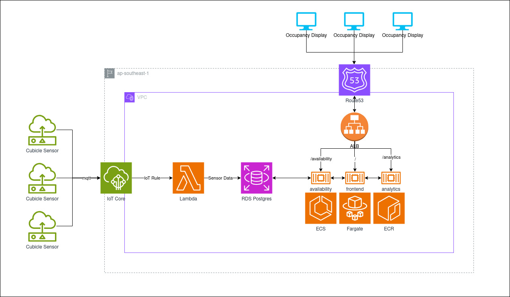

# 50.046 Cloud Computing and IoT - Final Project

## Project Description

Our goal is to create an analytics system for restrooms in places with high traffic (e.g. Shopping malls and institutions).

The main features of our project:

- Display of restroom unit occupancy to surrounding people, increasing convenience and improving the experience of urgent restroom users.
- Analysis of restroom usage to encourage efficient cleaning and maintenance deployments.

To execute this we have come up with the following solution.

## System Diagram



## Architecture Overview

### Cloud Infrastructure (AWS)

- **IoT Core**: MQTT broker for sensor data ingestion
- **Lambda**: Serverless function processing sensor messages
- **RDS PostgreSQL**: Central database with RDS Proxy
- **ECS Fargate**: Container orchestration for microservices
- **Application Load Balancer (ALB)**: HTTPS/HTTP load balancer with SSL termination
- **Route53**: DNS management with custom domain support
- **ECR**: Container registry for Docker images
- **CloudWatch**: Centralized logging and monitoring
- **Secrets Manager**: Secure credential storage

### Microservices

1. **Availability Service** (Port 8001)
   - REST API for real-time occupancy data
   - Health checks and status endpoints
   - Path: `/availability/*`

2. **Analytics Service** (Port 8002)
   - REST API for usage analytics and reporting
   - Historical data analysis
   - Path: `/analytics/*`

3. **Lambda Function**
   - Processes IoT sensor messages
   - Stores time-series data in RDS
   - Triggered by IoT Core rules

## Quick Start

For detailed instructions, see [QUICK-START.md](QUICK-START.md)

### Prerequisites

- AWS CLI v2
- Terraform >= 1.0
- Docker
- Make
- AWS account with appropriate permissions

## Production Deployment

### Step 1: Create RDS Credentials

**Important**: Do this FIRST before running Terraform!

```bash
aws secretsmanager create-secret \
  --name rds_credentials \
  --secret-string '{"username":"iot_master","password":"YourSecurePassword123!"}'
```

### Step 2: Configure Domain (Optional)

If you want to use a custom domain with HTTPS:

1. Edit `infra/terraform.tfvars`:
   ```hcl
   domain_name = "iot.yourdomain.com"  # or use root domain
   ```

2. The infrastructure will automatically:
   - Create Route53 hosted zone
   - Request ACM SSL certificate
   - Configure DNS validation
   - Set up HTTPS on ALB

### Step 3: Deploy Infrastructure

```bash
cd infra
terraform init
terraform plan
terraform apply
```

**Deployment time**: 10-15 minutes (RDS takes longest)

**What gets created**:
- VPC with public/private subnets across 2 AZs
- RDS PostgreSQL instance with RDS Proxy
- ECS cluster with Fargate tasks
- Application Load Balancer with HTTPS
- Route53 hosted zone (if domain configured)
- ACM certificate (if domain configured)
- IoT Core thing, certificate, and policies
- Lambda function with IoT rule
- CloudWatch log groups
- IAM roles and security groups

### Step 4: Configure DNS (If Using Custom Domain)

After Terraform completes:

```bash
# Get nameservers
terraform output route53_nameservers
```

Update your domain registrar with the AWS nameservers. See [infra/ROUTE53_QUICKSTART.md](infra/ROUTE53_QUICKSTART.md) for detailed instructions.

### Step 5: Save IoT Certificates

```bash
cd infra
make save-iot-certs
```

Certificates will be saved to `iot-certificates/` directory.

### Step 6: Deploy Backend Services

```bash
cd backend

# Deploy both services
make deploy-all

# Or deploy individually
make deploy-availability
make deploy-analytics
```

**Deployment time**: 5-8 minutes per service

**What happens**:
1. Builds Docker image
2. Pushes to ECR with multiple tags (`:latest`, `:service-latest`, `:timestamp`, `:git-sha`)
3. Registers new ECS task definition (forces fresh image pull)
4. Updates ECS service
5. Waits for health checks
6. Drains old tasks

### Step 7: Verify Deployment

```bash
# Check service status
cd backend
make status-all

# Health check
make health-check

# Or manually
curl https://yourdomain.com/availability/health
# Expected: {"status":"healthy"}
```

### Step 8: Test Your API

```bash
# Get service URLs
cd infra
terraform output availability_service_url
terraform output analytics_service_url

# Test endpoints
curl https://yourdomain.com/availability/health
curl https://yourdomain.com/analytics/health
```

## Production URLs

After deployment, your services will be available at:

- **With custom domain**:
  - Availability: `https://yourdomain.com/availability`
  - Analytics: `https://yourdomain.com/analytics`

- **Without custom domain** (ALB DNS):
  - Availability: `http://iot-alb-xxx.ap-southeast-1.elb.amazonaws.com/availability`
  - Analytics: `http://iot-alb-xxx.ap-southeast-1.elb.amazonaws.com/analytics`

## Backend Development & Deployment

### Making Code Changes

```bash
# 1. Edit your code
vim backend/availability-service/app/main.py

# 2. Test locally (optional)
cd backend
docker build -f availability-service/Dockerfile -t availability-service:latest .
docker run -p 8001:8001 availability-service:latest

# 3. Deploy to AWS
make deploy-availability

# 4. Monitor deployment
make watch-deployment-availability

# 5. Check logs
make logs-availability

# 6. Verify
curl https://yourdomain.com/availability/health
```

### Why Deployments Work Now

Previously, pushing new images to ECR didn't update running containers. This is fixed!

**The solution**: On each deploy, we:
1. Register a NEW task definition revision
2. ECS resolves `:latest` tag to current ECR digest
3. Service update picks up fresh image

See [backend/DEPLOYMENT_SUCCESS.md](backend/DEPLOYMENT_SUCCESS.md) for details.

### Common Backend Commands

```bash
cd backend

# View all commands
make help

# Deploy services
make deploy-all                   # Deploy both services
make deploy-availability          # Deploy availability only
make deploy-analytics            # Deploy analytics only

# Check status
make status-all                  # Status of all services
make status-availability         # Availability service status
make health-check               # Test endpoints

# View logs
make logs-availability          # Stream availability logs
make logs-analytics            # Stream analytics logs

# Monitor deployments
make watch-deployment-availability
make wait-for-stable-availability

# List images
make list-images               # Recent ECR images

# Build/push only (no deploy)
make build-availability        # Build image locally
make push-availability         # Push to ECR
```

## Running Locally

The goal of local development is to approximate the cloud components (Lambda, RDS/Postgres, IoT Core MQTT, Secrets Manager) with lightweight containers so frontend and backend teams can iterate rapidly.

### Overview of Local Substitutions

| Cloud Component                   | Local Equivalent                                                             |
| --------------------------------- | ---------------------------------------------------------------------------- |
| AWS Lambda (Node 20)              | Node HTTP wrapper calling the same handler (`lambda/local-server.ts`)        |
| RDS (Postgres)                    | `postgres` container                                                         |
| Secrets Manager (rds_credentials) | `.env` file (`DB_USER`, `DB_PASSWORD`, etc.)                                 |
| IoT Core MQTT topics              | Eclipse Mosquitto broker (`mqtt` service)                                    |
| IoT Rule -> Lambda                | Bridge sidecar (`bridge-mqtt-to-lambda`) invoking local lambda HTTP endpoint |

### 1. Copy Environment File

Create your local `.env` from the example:

```bash
cp .env.example .env
```

Edit values as needed (e.g. stronger passwords). Docker Compose will read them automatically.

### 2. Start the Stack

```bash
docker compose up -d --build
```

Services started:

- Postgres (port 5432)
- Mosquitto MQTT broker (port 1883)
- Local Lambda emulator (HTTP invoke on `http://localhost:8080/invoke`)
- Bridge container subscribing to `sensors/#` MQTT topics and invoking the lambda
- Placeholder `backend` and `frontend` containers (replace commands once you add code)

### 3. Create Table Schema

The lambda expects a table `sensor_data` with a `payload` column:

```bash
docker compose exec postgres psql -U "$DB_USER" -d "$DB_NAME" -c 'CREATE TABLE IF NOT EXISTS sensor_data (id SERIAL PRIMARY KEY, payload JSONB, created_at TIMESTAMPTZ DEFAULT NOW());'
```

### 4. Simulate an IoT Message

Publish a test MQTT message:

```bash
mosquitto_pub -h localhost -p 1883 -t sensors/device123 -m '{"temperature":23.5,"humidity":45}'
```

The bridge should invoke the lambda, which inserts a row into Postgres.

Verify insertion:

```bash
docker compose exec postgres psql -U "$DB_USER" -d "$DB_NAME" -c 'SELECT * FROM sensor_data ORDER BY id DESC LIMIT 1;'
```

### 5. Invoke Lambda Directly (Optional)

```bash
curl -X POST http://localhost:8080/invoke -H 'Content-Type: application/json' -d '{"manual":true}'
```

### 6. Tear Down

```bash
docker compose down -v
```

## Infrastructure Management

### Common Terraform Commands

```bash
cd infra

# View all commands
make help

# Initialize Terraform
make init

# Preview changes
make plan

# Deploy infrastructure
make apply

# Destroy infrastructure
make destroy

# Show outputs
make output
make output-summary

# Check infrastructure status
make status
make check-health

# View logs
make logs-lambda
```

### Infrastructure Updates

To update infrastructure:

```bash
cd infra

# 1. Make changes to .tf files
vim alb.tf

# 2. Preview changes
make plan

# 3. Apply changes
make apply
```

## Monitoring & Troubleshooting

### View Logs

```bash
# Backend services
cd backend
make logs-availability
make logs-analytics

# Lambda function
cd infra
make logs-lambda

# Or directly with AWS CLI
aws logs tail /ecs/availability-service --follow --region ap-southeast-1
```

### Check Service Health

```bash
cd backend
make health-check

# Or manually
curl https://yourdomain.com/availability/health
curl https://yourdomain.com/analytics/health
```

### Common Issues

#### Service Not Starting

```bash
# Check logs
cd backend
make logs-availability

# Check ECS events
aws ecs describe-services \
  --cluster my-cluster \
  --services availability-service \
  --region ap-southeast-1 \
  --query 'services[0].events[0:10]'
```

#### Can't Push to ECR

```bash
cd backend
make ecr-login
```

#### Health Check Failing

1. Wait 3-5 minutes for deployment
2. Check ALB target group health
3. Verify FastAPI has correct `root_path` configured

#### DNS Not Resolving

```bash
# Check nameservers
dig NS yourdomain.com +short

# Should show AWS nameservers
# If not, update at your domain registrar
```

See [backend/DEPLOYMENT_GUIDE.md](backend/DEPLOYMENT_GUIDE.md) for comprehensive troubleshooting.

## Security Best Practices

1. **Never commit secrets to Git**
   - Use AWS Secrets Manager
   - Add `.env` to `.gitignore`

2. **Use strong passwords**
   - Generate secure passwords for RDS credentials
   - Rotate regularly

3. **Enable HTTPS**
   - Configure custom domain for automatic SSL
   - HTTP automatically redirects to HTTPS

4. **Review security groups**
   - Minimal ingress rules
   - VPC isolation for RDS and ECS tasks

5. **Use IAM roles, not access keys**
   - Already configured in infrastructure
   - No hardcoded credentials

## Project Structure

```
50046-iot-project/
├── backend/
│   ├── availability-service/        # Occupancy REST API
│   ├── analytics-service/           # Analytics REST API
│   ├── shared/                      # Shared Python code
│   ├── scripts/
│   │   └── update-task-definition.sh  # ECS deployment helper
│   ├── Makefile                     # Deployment commands
│   ├── DEPLOYMENT_GUIDE.md          # Detailed deployment docs
│   ├── DEPLOYMENT_SUCCESS.md        # ECS fix summary
│   └── ECS_FIX_SUMMARY.md          # Technical details
├── infra/
│   ├── *.tf                        # Terraform configuration
│   ├── Makefile                    # Infrastructure commands
│   ├── ROUTE53_QUICKSTART.md       # DNS setup guide
│   ├── ROUTE53_README.md           # Route53 detailed docs
│   └── SSL_README.md               # SSL certificate guide
├── lambda/
│   └── handler.js                  # IoT message processor
├── frontend/                       # (Future: React app)
├── iot-certificates/               # Generated IoT device certs
├── docker-compose.yml              # Local development
├── QUICK-START.md                  # Detailed quick start
└── readme.md                       # This file
```

## Documentation

- **[QUICK-START.md](QUICK-START.md)** - Comprehensive getting started guide
- **[infra/ROUTE53_QUICKSTART.md](infra/ROUTE53_QUICKSTART.md)** - DNS setup in 5 steps
- **[infra/ROUTE53_README.md](infra/ROUTE53_README.md)** - Complete Route53 documentation
- **[infra/SSL_README.md](infra/SSL_README.md)** - SSL certificate setup
- **[backend/DEPLOYMENT_GUIDE.md](backend/DEPLOYMENT_GUIDE.md)** - Deployment troubleshooting
- **[backend/DEPLOYMENT_SUCCESS.md](backend/DEPLOYMENT_SUCCESS.md)** - ECS deployment fix
- **[backend/DEPLOYMENT_FLOW.md](backend/DEPLOYMENT_FLOW.md)** - Visual deployment diagrams

## Key Configuration

| Component | Value |
|-----------|-------|
| **AWS Region** | ap-southeast-1 (Singapore) |
| **ECS Cluster** | my-cluster |
| **ECR Repository** | iot |
| **Database** | PostgreSQL 16.3 on RDS |
| **Services** | availability-service, analytics-service |
| **Load Balancer** | iot-alb |
| **Domain** | Configurable in terraform.tfvars |

## Cost Estimate (Monthly)

- **RDS db.t3.micro**: ~$15
- **ECS Fargate (2 tasks)**: ~$25
- **ALB**: ~$20
- **NAT Gateway**: ~$35
- **Route53 Hosted Zone**: $0.50
- **Data Transfer**: Variable
- **Total**: ~$100-120/month

*ACM SSL certificates are FREE*

## Team Workflow

### Daily Development

```bash
# 1. Make changes
vim backend/availability-service/app/main.py

# 2. Deploy
cd backend && make deploy-availability

# 3. Verify
make health-check
```

### Adding New Endpoints

1. Update FastAPI code in `backend/*/app/main.py`
2. Deploy with `make deploy-availability`
3. Test with `curl https://yourdomain.com/availability/your-endpoint`

### Infrastructure Changes

1. Update Terraform files in `infra/`
2. Run `make plan` to preview
3. Run `make apply` to deploy
4. Commit changes to Git

## Getting Help

### Check Status

```bash
# Services
cd backend && make status-all

# Infrastructure
cd infra && make status
```

### View Logs

```bash
cd backend
make logs-availability
make logs-analytics
```

### Common Commands

```bash
# Deploy everything
cd backend && make deploy-all

# Health check
cd backend && make health-check

# Infrastructure status
cd infra && make status
```

## Contributing

1. Create feature branch
2. Make changes
3. Test locally with Docker Compose
4. Deploy to AWS and verify
5. Create pull request

## License

MIT License - See LICENSE file for details

---

**Project**: 50046 Cloud Computing and IoT Final Project  
**System**: IoT Restroom Analytics Platform  
**Last Updated**: December 2025

**Pro Tips**:
- Keep [QUICK-START.md](QUICK-START.md) open while working 🔖
- Use `make help` to see available commands in any directory
- Monitor deployments with `make watch-deployment-availability`
- Always run `make health-check` after deploying

---

**For detailed instructions, see [QUICK-START.md](QUICK-START.md)**